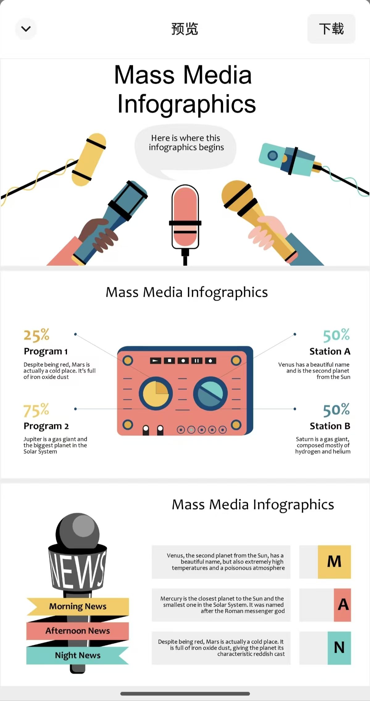

<div align="center">

# gpt-image2-ppt-skills

**用 OpenAI `gpt-image-2` 一键生成视觉强烈的 PPT。**

喂一份大纲（甚至喂一份别人的 .pptx 模板），自动产出 16:9 高清图片 + 可键盘翻页的 HTML viewer + 打包好的 `.pptx`。Claude Code Skill / OpenClaw Skill。

[](./LICENSE)
[](https://www.python.org/)
[](https://www.anthropic.com/claude-code)
[](https://platform.openai.com/docs/guides/images)

🌐 **English** → [docs/README.en.md](./docs/README.en.md)

</div>

---

## 🎬 效果演示：喂一张模板，仿出一套新内容

<table>
<tr>
<th width="50%">输入：任意一页参考模板 (.pptx / 图片)</th>
<th width="50%">输出：本 skill 仿制 + 换内容</th>
</tr>
<tr>
<td></td>
<td></td>
</tr>
<tr>
<td align="center"><sub>英文信息图模板（Mass Media Infographics）</sub></td>
<td align="center"><sub>同一版式 / 同一配色 / 同一插画语汇，内容换成「普通人怎么用 AI 做自媒体」</sub></td>
</tr>
</table>

> 不传模板？10 套内置风格任选一套，直接出图。👇

---

## ✨ 核心能力

- 🎨 **十套精选风格** — Spatial Glass / Tech Blue / Editorial Mono / Dark Aurora / Riso / Wabi / Swiss Grid / Hand Sketch / Y2K Chrome / Vector Illustration，每套都细分 `cover` / `content` / `data` 三种构图
- 🪄 **模板克隆模式** — 传一个 `.pptx`，自动 LibreOffice 渲染 + vision 抽风格 + JSON Schema 复刻，像上面这张图一样仿版式换内容
- 🤖 **官方 OpenAI Images API** — 模型 `gpt-image-2`，`base_url` 可换任意 OpenAI 兼容中转
- 🎮 **HTML viewer + `.pptx` 双产出** — 键盘翻页 / 空格自动播放 / ESC 全屏 / 触摸滑动，同时打包成 16:9 `.pptx`
- 🧩 **逐页迭代** — `--slides 1,3,5` 只生指定页，跑过的自动跳过，不浪费 credits
- ⚡ **并发出图** — 默认 10 路并发，10 页 ~30s 出完
- 🔁 **双后端** — `openai` 直调（默认，需 key）或 `codex` CLI（复用 codex 登录，无需在本 skill 配 key）

---

## 🚀 60 秒上手

```bash
git clone git@github.com:JuneYaooo/gpt-image2-ppt-skills.git
cd gpt-image2-ppt-skills
bash install_as_skill.sh
```

安装脚本会把 skill 装到 `~/.claude/skills/gpt-image2-ppt-skills/`，Claude Code 重启后自动识别。

然后填一个 key：

```bash
# 编辑 ~/.claude/skills/gpt-image2-ppt-skills/.env
OPENAI_BASE_URL=https://api.openai.com    # 或任意 OpenAI 兼容中转
OPENAI_API_KEY=sk-...                     # 必需
GPT_IMAGE_MODEL_NAME=gpt-image-2
GPT_IMAGE_QUALITY=high                    # low / medium / high / auto
```

跑一页冒烟：

```bash
python3 scripts/generate_ppt.py \
  --plan slides_plan.json \
  --style styles/gradient-glass.md \
  --slides 1
```

产物：`outputs/<timestamp>/images/slide-01.png` + 同目录下的 `index.html`（浏览器打开就是可翻页 viewer）。

> 🔒 **不会误吃密钥**：只从 `<script_dir>/.env`、`~/.claude/skills/.../env`、`~/skills/.../env` 或显式 `GPT_IMAGE2_PPT_ENV` 加载，**不会**向上递归读项目目录的 `.env`。

---

## 📝 写一份 slides_plan

推荐写 md（人审阅、方便 diff），再一键转 json：

```markdown
---
title: 我的演示
---

## [cover] xxx 产品发布

副标题：yyy

## [content] 三个核心能力

- 能力一：...
- 能力二：...
- 能力三：...

## [data] 数据对比

传统方案 5000 元 / 5 天
本方案 几乎 0 元 / 一下午
```

```bash
python3 scripts/md_to_plan.py slides_plan.md -o slides_plan.json
```

或者直接手写 `slides_plan.json`：

```json
{
  "title": "我的演示",
  "slides": [
    {"slide_number": 1, "page_type": "cover",   "content": "标题：xxx\n副标题：yyy"},
    {"slide_number": 2, "page_type": "content", "content": "三个要点..."},
    {"slide_number": 3, "page_type": "data",    "content": "对比数据..."}
  ]
}
```

`page_type`：`cover` / `content` / `data`，会影响生图构图。

---

## 🎨 十种内置风格

| 风格 ID | 一句话定位 | 适用场景 |
| --- | --- | --- |
| `gradient-glass` | Apple Vision OS / Spatial Glass | AI 产品发布、技术分享、创意提案 |
| `clean-tech-blue` | Stripe / Linear 级蓝白 | 融资路演、商业计划书、企业战略 |
| `vector-illustration` | 复古矢量插画 + 黑描边 | 教育培训、品牌故事、社区分享 |
| `editorial-mono` | Kinfolk / Monocle 编辑设计 | 品牌发布、文化访谈、读书分享 |
| `dark-aurora` | Linear / Vercel 深色霓虹 | AI 产品、开发者工具、技术分享 |
| `risograph` | Riso 双套色印刷 + 网点纹理 | 创意工作室、文创品牌、独立 zine |
| `japanese-wabi` | 无印 / 原研哉式侘寂 | 茶道、生活方式、奢侈品、文化讲座 |
| `swiss-grid` | Bauhaus / Vignelli 国际主义网格 | 学术报告、博物馆展陈、严肃汇报 |
| `hand-sketch` | Sketchnote / 白板手绘 | 工作坊、产品 brainstorming、培训 |
| `y2k-chrome` | Y2K 千禧液态金属 + 蝴蝶贴纸 | 潮牌、文娱、品牌联名、Z 世代营销 |

每套风格完整 prompt 在 `styles/<id>.md`，按 cover / content / data 三种构图分别给出版式规范。

---

## 🪄 模板克隆模式

上面「效果演示」那张图就是这个模式产出的。一行命令：

```bash
python3 scripts/generate_ppt.py \
  --plan slides_plan.json \
  --template-pptx ./company-template.pptx \
  --template-strict
```

`--template-strict` 表示每页都把模板对应页作为 image reference 传给 gpt-image-2，仿真度最高。

**幕后流程**：

1. 自动调 LibreOffice（本机 → docker `linuxserver/libreoffice` 兜底）把模板渲染成每页 PNG
2. 让 agent 自己看 PNG 抽风格（多模态 agent 如 Claude Code / codex 免外挂），结果写到 `template_cache/<sha256>.json`
3. 按 `slides_plan` 每页内容匹配模板 layout，套用版式 + image reference 出新图

**中间产物**（建议加 `.gitignore`）：

| 路径 | 内容 |
| --- | --- |
| `<cwd>/template_renders/<stem>/page-NN.png` | LibreOffice 渲染的每页 PNG |
| `<cwd>/template_cache/<sha256>.json` | vision 风格分析缓存，后续同一模板秒匹配 |
| `<cwd>/outputs/<timestamp>/` | 每次生成产物 |

**可选**：只有当调用本 skill 的 agent 是纯文本模型时，才需要配 `VISION_BASE_URL` / `VISION_API_KEY` / `VISION_MODEL_NAME` 把 vision 外挂到 Gemini / GPT-4o / Claude 等兼容端点。Claude Code / codex 开箱即用，不用配。

---

## 🛠 在 Claude Code 里自然语言调用

装完之后，直接跟 Claude 说：

> 帮我用 gpt-image2-ppt 生成一份关于 **[你的主题]** 的 5 页 PPT，风格用 `clean-tech-blue`。

Claude 会：

1. 问你具体内容，写 `slides_plan.md` 给你审
2. 转成 `slides_plan.json`
3. `--slides 1` 先出封面让你确认
4. 跑全量，把 viewer + `.pptx` 路径告诉你

仿模板同理：

> 我这有一个 `company-template.pptx`，帮我按这个模板做一份关于 xxx 的 5 页 PPT。

---

## 🧩 常见姿势

```bash
# 只重生第 3 和第 5 页（已有的自动跳过）
python3 scripts/generate_ppt.py --plan slides_plan.json --style styles/dark-aurora.md --slides 3,5

# 走 codex CLI 后端（不需要在本 skill 配 key，复用 codex 登录）
python3 scripts/generate_ppt.py --plan slides_plan.json --style styles/editorial-mono.md --backend codex

# 强制重跑模板 vision（默认会读缓存）
python3 scripts/generate_ppt.py ... --rebuild-template-cache

# 只出图不打包 pptx
python3 scripts/generate_ppt.py ... --no-pptx
```

---

## 📦 依赖

- Python 3.8+
- `pip install -r requirements.txt`（`requests` / `python-dotenv` / `python-pptx` / `jsonschema` / `pymupdf`）
- **仅模板克隆模式额外需要**：本机 `libreoffice` 或本机 docker + `linuxserver/libreoffice` 镜像

---

## 🙏 致谢

- [op7418/NanoBanana-PPT-Skills](https://github.com/op7418/NanoBanana-PPT-Skills) — 风格 prompts 与 viewer 模板的原始作者。本项目把图片后端从 Nano Banana Pro 换成了 OpenAI gpt-image-2，重写了继承自上游的 3 套风格并新增 7 套（共 10 套），另加入模板克隆模式（vision 抽风格仿任意 `.pptx`）、md-first 编排流程、`.pptx` 自动打包、codex CLI 备用后端等新功能。
- [lewislulu/html-ppt-skill](https://github.com/lewislulu/html-ppt-skill) — Claude Code skill SKILL.md frontmatter 写法参考。

## License

Apache License 2.0，详见 [LICENSE](./LICENSE)。
